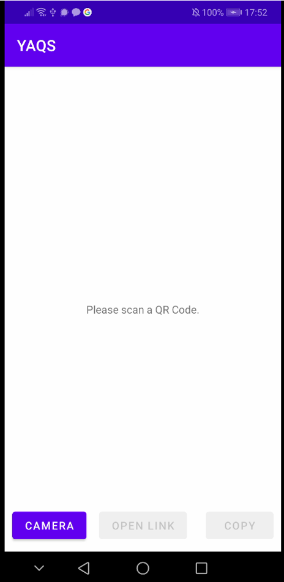
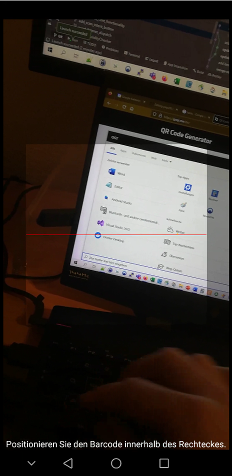
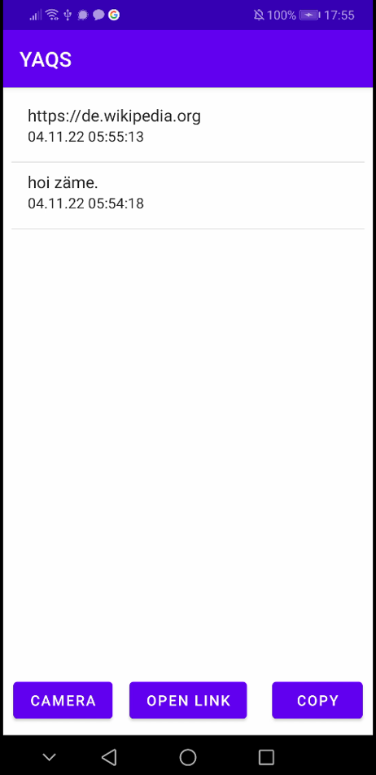

# Yaqs

This is Yet Another QR-Code Scanner... yaqs, ahm no, yay!

It does what a QR-code scanner is supposed to do: scan a QR code, interpret all the pixels, translate this into a human-readable format, and let the user do something with that scan result.

## Features for users
- Scan a QR code
- check if URL: open link and copy to Clipboard
- check if simple text: copy to Clipboard only
- history with persistent storage
- delete entries from history

---

## Screenshots




---

## Features for grading
- Kotlin: 6P
- Functions: 4P (scan, copy, open, delete)
- Persistence: 2P (database)
- Notifications: 1P (Toast)
- Actors: 1P (camera)
- Third party libraries: 1P (zxing)
- Bonus points  ¯\\\_(ツ)_/¯ 


## Yaqs Haiku
```
Scan wisely with Yaqs
It observes everything
Saves it forever
```